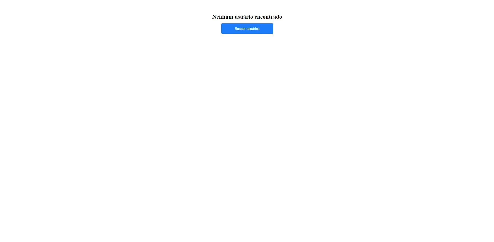
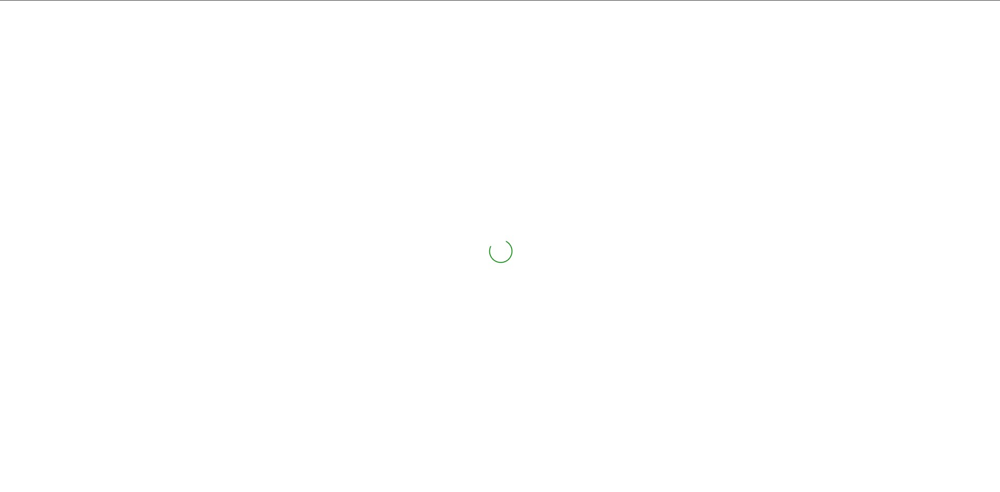
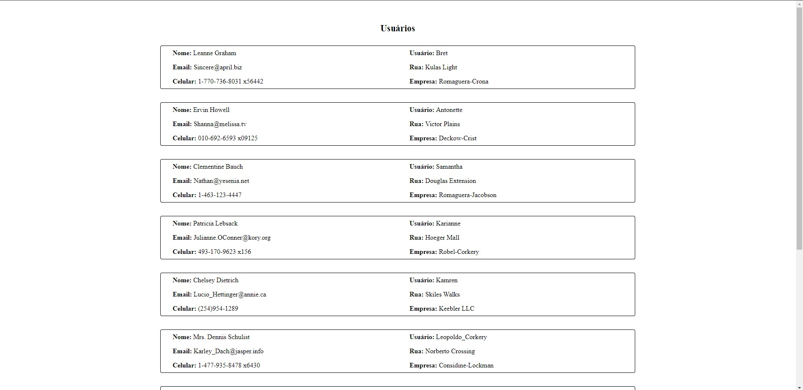
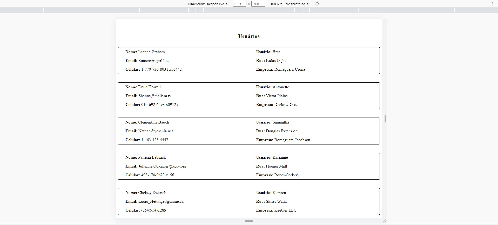
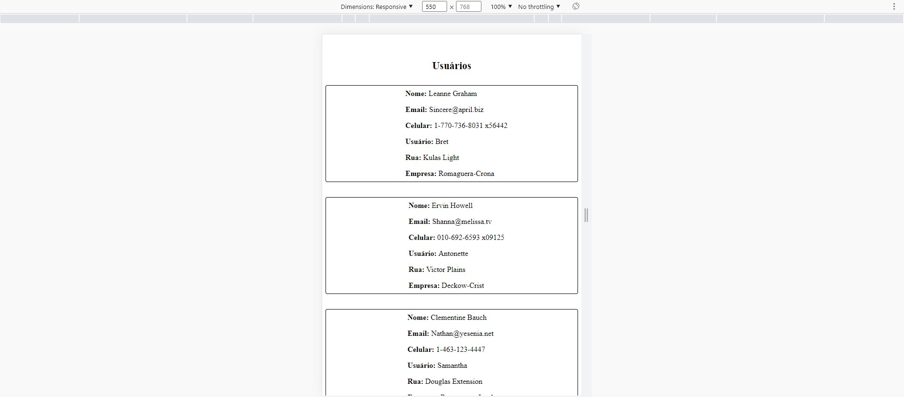

# Frontend Developer - Test

## Detalhes ##
- Exibir mensagem informativa e botão para fazer busca dos usuários
- Fazer uma requisição de **GET** exibindo uma lista de usuários no endpoint de **/users**
- Exibir listagem de usuários
- Chamada na API deve estar em uma função isolada contendo lógica do Axios
- Chamada do click do botão deve estar no contexto e o state que armazenará os users também.

## Informações técnicas ##
- Fazer as requisições necessárias na API https://jsonplaceholder.typicode.com/.
- Atente-se a qualidade do código.
- Necessário que o site seja responsivo para diversos tamanhos de telas.
  - Mobile breakpoint até 550px
  - Tablet breakpoint até 1023px
  - Desktop a partir de 1024px
- Utilizar **ContextApi** para armazenar states.
- Utilizar **Axios** para fazer a requisição na API.
- Utilizar **Styled Components** para tratar HTML e CSS.
- Utilizar **TypeScript**.
- Utilizar regras e padrões de **ESLint** e/ou **Prettier**.
- Ter testes funcionais utilizando **Jest** e **React Testing Library**

## Layout ##
Tela inicial

Carregando

Usuários Desktop

Usuários Tablet

Usuários Mobile

